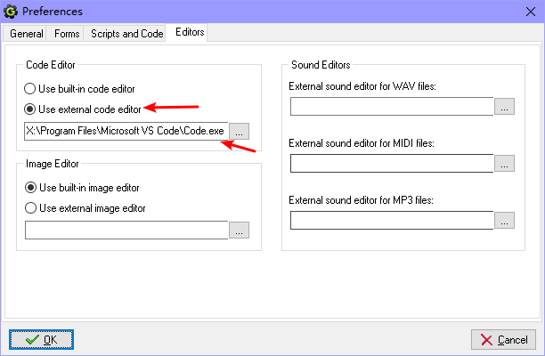

# GML Support with GameMaker 8.1

Go to Preferences -> Editor, select the 'Use external code editor' in the code window and select the Visual Studio Code program, click OK to save.

Double-click on the script or `Execute Code` button in the object will open the Visual Studio Code, as is open in `txt` format, you need to click the lower right corner of the` Text `switch language, switch to` GameMaker Language (GameMaker 8.1) `to use.

**P.S.: If Visual Studio Code has administrator privileges, you will need to verify that GameMaker 8.1 has administrator privileges or you will immediately return to the GameMaker interface.**

