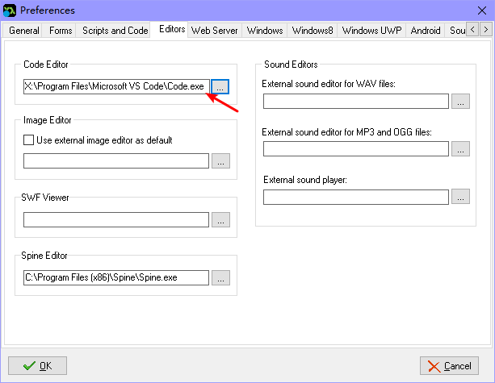
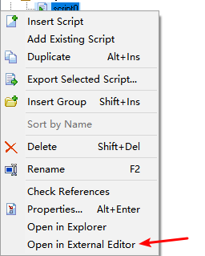
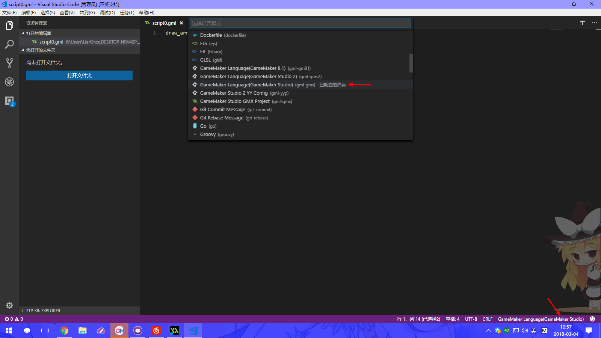

# GML Support with GameMaker Studio

Go to Preferences -> Editors and select Visual Studio Code in the Code Editor,  and click OK to save.

Double-clicking the script does not immediately open the Visual Studio Code, right-click the script, and select Open in External Editor.

When you enter Visual Studio Code, the code language is recognized immediately, but it is not recognized (the default is `GameMaker Language (GameMaker Studio 2)`, you need to manually select `GameMaker Language (GameMaker Studio)` .

**P.S.: Due to the nature of GameMaker Studio, the `Execute Code` button in the object does not use an external editor to open, only open `Scripts` script here.**