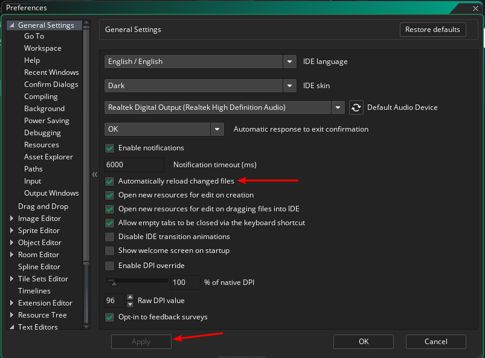
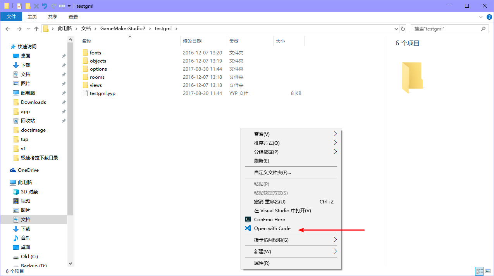
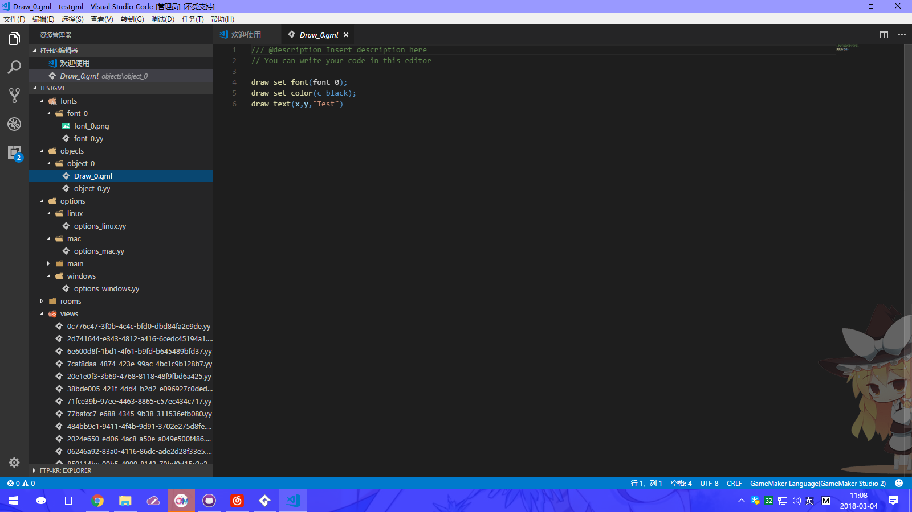

# GML Support with GameMaker Studio 2

Go to Preferences -> General Settings and check `Automatically reload changed files`.

Open the game project directory, in the blank right-click `Open with Code`.

This can be used, and the normal recognition, no need to switch.

At this point all changes in Visual Studio Code will be synchronized to GameMaker Studio 2.