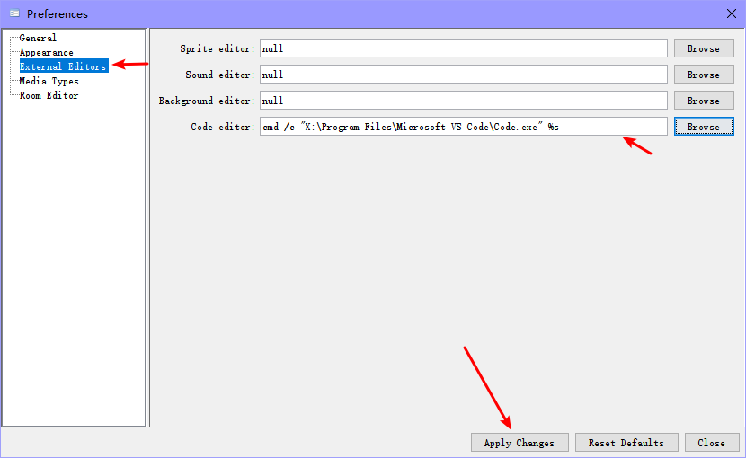
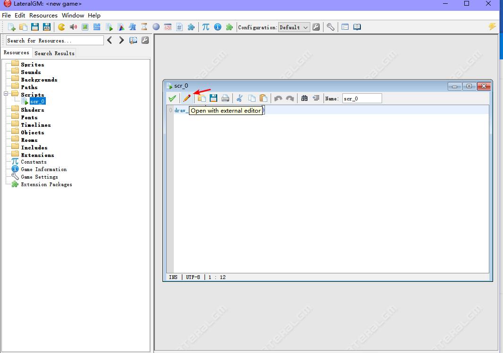
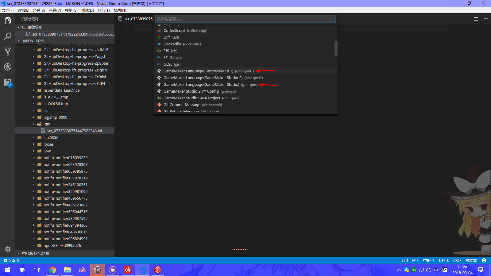

# GML Support with LateralGM

Go to Preferences -> External Editors, find the Code editor, click Browse, select Visual Studio Code, click Apply changes, and restart LateralGM.

Open the script or `Execute Code` button in the object after reboot, click `Open with external editor`.

After opening Visual Studio Code, you need to select the language manually. You can use `GameMaker Language (GameMaker 8.1)` and `GameMaker Language (GameMaker Studio)` (LateralGM does not support GameMaker Studio 2).

