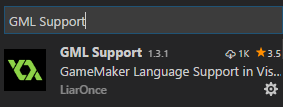

# 开始

在 Visual Studio Code 中直接搜索安装，重新加载即可。

## 预览版

访问 [https://github.com/LiarOnce/gml-support/releases](https://github.com/LiarOnce/gml-support/releases) 下载`vsix包`并进行安装。

PS: 这是 `Visual Studio Code` 专用包，如果你的电脑安装有 `Visual Studio`，请注意安装方式。

## 依赖

本插件需要 [`vscode-icons`](https://github.com/vscode-icons/vscode-icons) 和 [`Shader languages support for VS Code`](https://github.com/stef-levesque/vscode-shader)，这些将在本插件安装时自动安装。