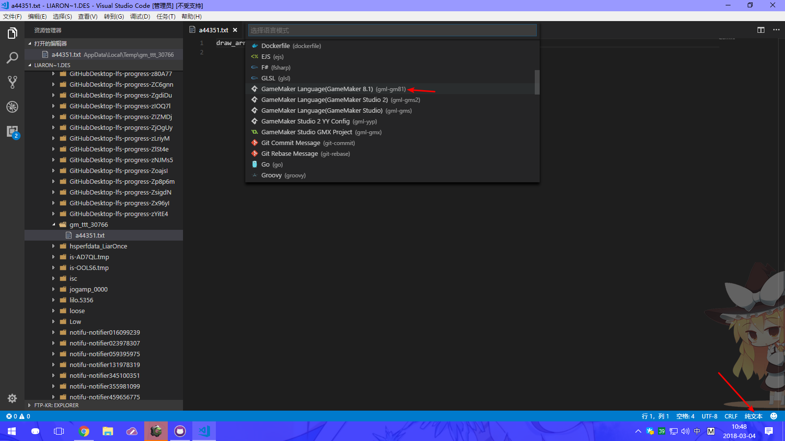

# GML Support with GameMaker 8.1

转到偏好设置 -> 编辑器，在代码窗口中选择 `使用外部代码编辑器` 并选择 Visual Studio Code 目录，点击完成后保存。

之后双击脚本或 obj 里的代码按钮都会打开 Visual Studio Code，由于是以 `txt` 格式打开，你需要点击右下角`纯文本`切换语言，切换为 `GameMaker Language(GameMaker 8.1)`后即可进行编辑并保存。

**P.S. 由于 GameMaker 8.1 及以下版本未知 bug，你需要确认是否拥有管理员权限，否则会立即弹回 GameMaker 界面。**

