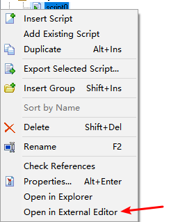

# GML Support with GameMaker Studio

转到 Preferences -> Editors，在 Code Editor 中选择 Visual Studio Code。

保存后双击脚本不会立刻打开 Visual Studio Code，需要右键脚本，选择 `Open in External Editor` 。

进入 Visual Studio Code 后会立刻识别代码语言，不过不会识别版本（默认是 `GameMaker Language(GameMaker Studio 2)`，需要手动选择 `GameMaker Language(GameMaker Studio)` 。

**P.S. 由于  GameMaker Studio 性质，对于 obj 内代码按钮的代码无法使用外部编辑器打开，此处只能打开 `Scripts` 的代码**

