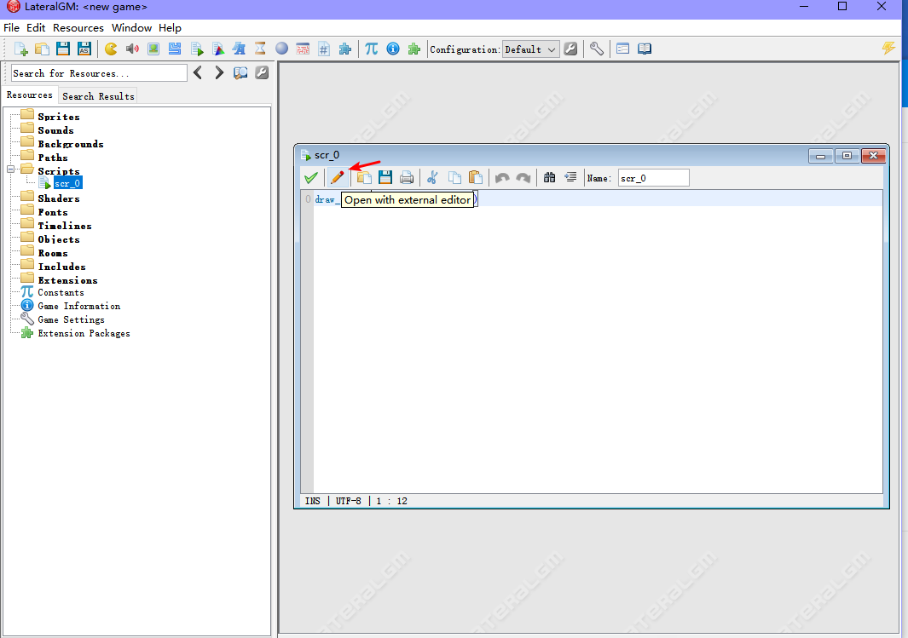

# GML Support with LateralGM

转到 Preferences -> External Editors，找到 Code editor，点击 `Browse` 选择 Visual Studio Code，点击 Apply changes，并重启 LateralGM 。

重启后打开脚本或 obj 的代码按钮，点击 `Open with external editor`， 

打开 Visual Studio Code 后需要手动选择语言，可选 `GameMaker Language(GameMaker 8.1)` 和 `GameMaker Language(GameMaker Studio)` （LateralGM 暂不支持 GameMaker Studio 2）。

 